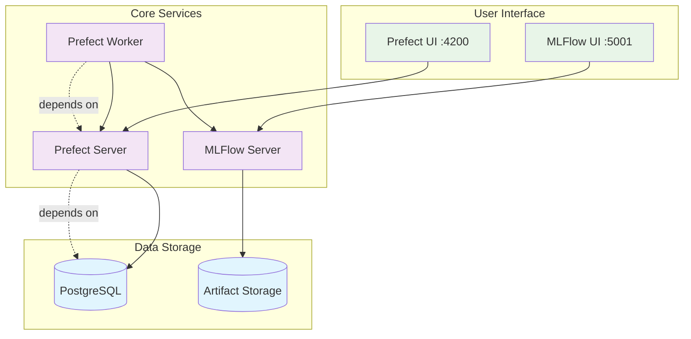

# Prefect Iris Classification Challenge

This is a challenge project that demonstrates how to use Prefect and MLflow to build, track, and deploy an Iris classification model. Students will need to complete the implementation of various components while following MLOps best practices.

## Challenge Description

In this challenge, you will implement a machine learning pipeline using Prefect and MLflow. The pipeline will:
1. Load and preprocess the Iris dataset
2. Train a Random Forest classifier
3. Track experiments with MLflow
4. Deploy the model using Prefect

Your task is to complete the implementation in the following files:
- `flows/iris_flow_mlflow.py`: Implement the main ML pipeline (create this file if it doesn't exist)
- `init_blocks/init.py`: Set up Prefect blocks and variables
- `deployments/create_deployment.py`: Create a deployment for the flow that fetches the latest version of the flow from GitHub or use a local flow (see chapter 5)
- `docker-compose.yml`: Complete the prefect-init service configuration

The test suite in `tests/` will help validate your implementation.

## Important Notes

## Prerequisites

- Docker and Docker Compose
- Git
- GitHub Personal Access Token with `repo` scope

## Setup

1. Clone the repository:
```bash
git clone https://github.com/your-username/prefect-iris-classification.git
cd prefect-iris-classification
```

2. Create a `.env` file in the root directory with the following content:
```bash
PREFECT_API_URL=http://127.0.0.1:4200/api
GH_TOKEN=your_github_token
GITHUB_REPOSITORY=your-username/prefect-iris-classification  # Must use this exact repository name
GITHUB_BRANCH=main
POSTGRES_PASSWORD=prefect
```

Replace:
- `your_github_token` with your actual GitHub Personal Access Token
- `your-username` with your GitHub username

### Repository Name
This challenge requires your repository to be named exactly `prefect-iris-classification`. This is crucial for the tests to pass, as they rely on specific paths and configurations. Make sure to:
1. Name your repository `prefect-iris-classification` when you create it
2. Use this exact name in your `GITHUB_REPOSITORY` environment variable
3. Keep all file paths and names as they are in the original repository

### File Structure
The flow file must be created at exactly this location:
```sh
flows/
└── iris_flow_mlflow.py  # Create this file with the implementation
```

This specific path is required because:
- The deployment configuration expects this exact path
- The tests look for this specific file location
- The Docker setup mounts this path

## Implementation Tasks

1. **Main Flow Implementation** (`flows/iris_flow_mlflow.py`):
   - Implement data loading and preprocessing
   - Set up model training with configurable hyperparameters
   - Add MLflow tracking
   - Configure Prefect tasks and flow

2. **Block Initialization** (`init_blocks/init.py`):
   - Set up GitHub credentials
   - Configure repository access
   - Create default variables

3. **Deployment Creation** (`deployments/create_deployment.py`):
   - Create deployment from GitHub source
   - Configure work pool and tags

4. **Docker Compose Configuration** (`docker-compose.yml`):
   - Complete the prefect-init service configuration
   - Set up proper dependencies and environment variables
   - Configure command sequence for initialization

5. **Update integration test** (`tests/test_integration.py`)
   - Update your images names in the integration test file

## Running the Services

Start all services using Docker Compose command below:

```bash
docker compose up -d
```

This will start:
* Prefect Server (UI available at http://127.0.0.1:4200)
* MLflow Server (UI available at http://127.0.0.1:5001). Note on the VM, you might need to go to `http://<<your-VM-ip>>:5001`
* PostgreSQL database
* Prefect worker
* Required initialization services


## Validating Your Implementation

Run the test suite to validate your implementation:

```bash
docker-compose --profile test run --rm test
```

The tests will check:
- Model training functionality
- MLflow tracking integration
- Deployment configuration
- Docker environment setup

After successful completion, you are supposed to have the following output:

```sh
test_1            | tests/test_deployment.py::test_deployment_configuration PASSED           [ 25%]
test_1            | tests/test_deployment.py::test_deployment_run PASSED                     [ 50%]
test_1            | tests/test_integration.py::test_end_to_end_flow PASSED                   [ 75%]
test_1            | tests/test_integration.py::test_docker_deployment PASSED                 [100%]
test_1            |
test_1            | =============================== warnings summary ===============================
```

## Running the Flow

### Option 1: Using the Prefect UI

1. Open the Prefect UI at http://127.0.0.1:4200
2. Navigate to "Deployments"
3. Find the "iris-classification-flow/iris-model" deployment
4. Click "Run" to start a flow run
5. Monitor the run progress in the UI
6. Add a picture below showing the run success from prefect GUI


### Option 2: Using the Command Line

Run the deployment using the Prefect CLI:

```bash
docker compose exec prefect-worker prefect deployment run 'iris-classification-flow/iris-model'
```

Add below screen of the terminal :

```sh
# Add a output of your terminal (a short piece showing the successfull run)
```

## Monitoring and Tracking

- **Prefect UI** (`http://127.0.0.1:4200`or `http://VM-IP:4200`):
  - View flow runs and their status
  - Monitor task execution
  - Check logs and error messages

- **MLflow UI** (`http://127.0.0.1:5001`):
  - View experiment tracking
  - Compare model metrics
  - Access saved model artifacts

## Evaluation Criteria

Your implementation will be evaluated based on:
1. All tests passing successfully
2. Proper use of Prefect features (tasks, flows, variables)
3. Effective MLflow integration
4. Code organization and documentation
5. Error handling and logging
6. Correct Docker service configuration

## Troubleshooting

1. **No deployments visible in UI**:
   - Ensure all services are running: `docker compose ps`
   - Check prefect-init logs: `docker compose logs prefect-init`
   - Verify environment variables in `.env`
   - Make sure repository name is exactly "prefect-iris-classification"

2. **Worker not picking up runs**:
   - Check worker logs: `docker compose logs prefect-worker`
   - Ensure work pool "ml-pool" exists
   - Verify worker is connected to the correct API

3. **MLflow tracking issues**:
   - Check MLflow server logs: `docker compose logs mlflow`
   - Verify MLflow UI is accessible
   - Check tracking URI configuration

## Project Structure

```sh
.
├── deployments/          # Deployment configuration (to be implemented)
├── flows/               # Prefect flow definitions (to be implemented)
├── init_blocks/         # Prefect block initialization (to be implemented)
├── tests/              # Update lines 28-29 in test_integration.py depending on the docker version)
├── docker-compose.yml  # Docker services configuration (partially complete)
├── prefect.Dockerfile  # Prefect service image
└── mlflow.Dockerfile   # MLflow service image
```

Architecture Diagram :



Good luck!
